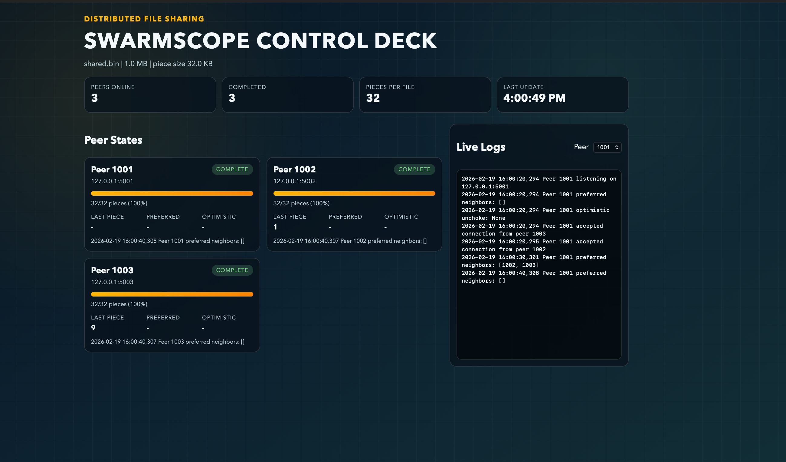
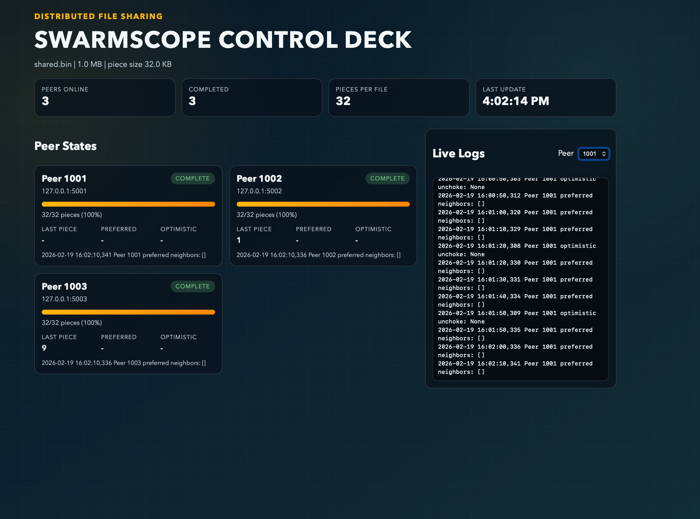

# distributed-file-sharing
Designed and implemented a BitTorrent-style distributed file sharing system using C++ and TCP/IP sockets. Built a peer-to-peer architecture supporting multi-node communication, fault tolerance, retry handling, and concurrent file transfers across Linux environments.The concurrency control to enable reliable 1GB+ multi-peer file transfers.

# Distributed File Sharing (BitTorrent-style MVP)

This project is a config-driven peer-to-peer file sharing system with:
- handshake validation
- choke/unchoke signaling
- bitfield + have messages
- piece request/response exchange
- per-peer logging for observability
- a live web dashboard for swarm monitoring

## Project layout

- `src/p2p/messages.py`: wire protocol + handshake
- `src/p2p/peer.py`: peer runtime, session logic, neighbor selection
- `src/p2p/config.py`: app config loader
- `src/run_peer.py`: entrypoint for a single peer process
- `src/dashboard_server.py`: serves frontend + monitoring APIs
- `config.json`: demo network config
- `scripts/make_seed_file.sh`: creates seed file (peer 1001)
- `scripts/run_demo.sh`: launches 3 local peers
- `scripts/run_with_dashboard.sh`: launches peers + web dashboard
- `frontend/`: dashboard UI

## Requirements

- Python 3.10+
- Linux/macOS terminal

## Run locally

1. Create the seed file for peer `1001`:

```bash
./scripts/make_seed_file.sh .
```

2. Start all peers:

```bash
./scripts/run_demo.sh .
```

3. Watch logs:

```bash
tail -f logs/peer_1001.log logs/peer_1002.log logs/peer_1003.log
```

4. Verify peers downloaded file:

```bash
ls -lh data/peer_1002/shared.bin data/peer_1003/shared.bin
```

## Web Dashboard

Run peers and dashboard together:

```bash
./scripts/run_with_dashboard.sh .
```

Then open:

```text
http://127.0.0.1:8080
```

You get:
- swarm overview metrics
- per-peer completion/progress cards
- preferred and optimistic neighbor state
- live per-peer log view

## Scale to more peers / larger files

- Add peers in `config.json`.
- Increase `file_size` and seed file size.
- Tune:
  - `piece_size`
  - `num_preferred_neighbors`
  - `unchoking_interval`
  - `optimistic_unchoking_interval`

## Notes

- This is an MVP protocol implementation for learning and portfolio use.
- It is intentionally simple and does not include cryptographic piece hashes or tracker/metadata exchange.
